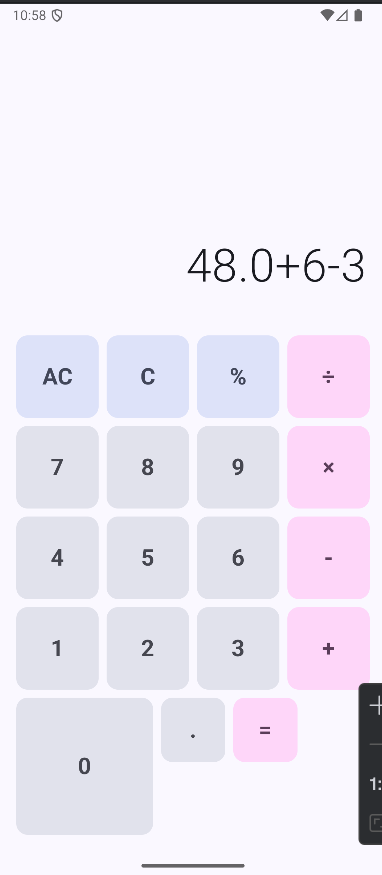
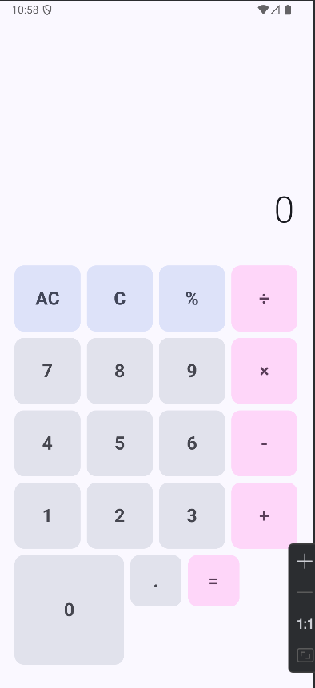

# Task 1: Simple Calculator

This application is a simple calculator developed in Kotlin using Jetpack Compose. The goal is to demonstrate the use of modern components and best practices in mobile UI development.

## 📑 Table of Contents

- [📝 Description](#-description)
- [✨ Features](#-features)
- [🛠️ Technologies Used](#️-technologies-used)
- [🚀 Installation](#-installation)
- [📱 Usage](#-usage)
- [🖼️ Screenshots](#-screenshots)
- [📂 Project Structure](#-project-structure)
- [🤝 Contributing](#-contributing)
- [📄 License](#-license)

## 📝 Description

The calculator allows you to perform basic operations such as addition, subtraction, multiplication, and division. The interface is intuitive and responsive, leveraging Jetpack Compose to create a modern Android experience.

## ✨ Features

- Friendly and responsive UI
- Basic mathematical operations
- Custom components with Jetpack Compose
- Simple error handling and validation

## 🛠️ Technologies Used

- **Kotlin**: Main development language
- **Jetpack Compose**: Declarative UI framework for Android
- **Android Studio**: Development environment

## 🚀 Installation

1. Clone the repository:
   ```bash
   git clone https://github.com/your-username/MobileDevCourse.git
   ```
2. Open the project in Android Studio.
3. Run the app on an emulator or physical device.

## 📱 Usage

1. Enter numbers and select the desired operation.
2. Press the equals button to see the result.
3. Use the clear button to reset the calculator.

## 🖼️ Screenshots

Below are screenshots of the app located in the `assets/` folder:

### Main Screen


### Operation Example


## 📂 Project Structure

```
Tarea1/
├── app/
│   ├── src/
│   │   ├── main/
│   │   │   ├── java/
│   │   │   │   └── ...
│   │   │   ├── res/
│   │   │   │   └── ...
│   │   │   └── AndroidManifest.xml
├── assets/
│   ├── image.png
│   ├── main.png
├── README.md
└── ...
```

## 🤝 Contributing

Contributions are welcome! Please open an issue or submit a pull request for suggestions or improvements.

## 📄 License

This project is licensed under the MIT License. See the `LICENSE` file for details.