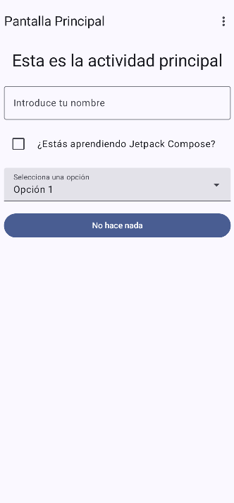
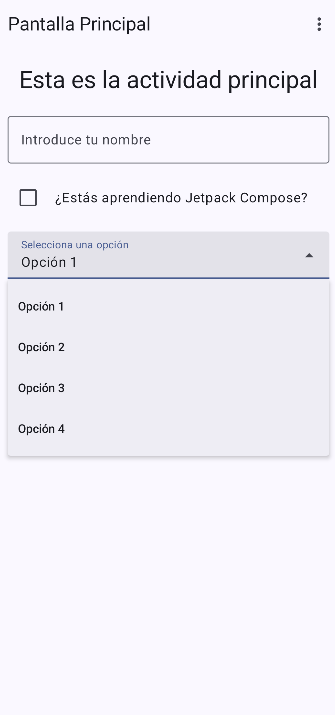
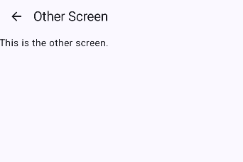

# Task 2: UI Elements and Navigation

This application is a demonstration of various UI elements and navigation in Kotlin using Jetpack Compose. The goal is to showcase the use of modern components and best practices in mobile UI development and screen navigation.

## 📑 Table of Contents

- [📝 Description](#-description)
- [✨ Features](#-features)
- [🛠️ Technologies Used](#️-technologies-used)
- [🚀 Installation](#-installation)
- [📱 Usage](#-usage)
- [📂 Project Structure](#-project-structure)
- [🤝 Contributing](#-contributing)
- [📄 License](#-license)

## 📝 Description

The application displays a main screen with various UI components like TextFields, Buttons, a Checkbox, and a Dropdown menu. It also includes a navigation menu to move to a secondary screen, demonstrating a basic navigation flow.

## ✨ Features

- Friendly and responsive UI
- Demonstration of various Jetpack Compose components (`TextField`, `Button`, `Checkbox`, `ExposedDropdownMenuBox`)
- Navigation between screens using `NavHost`
- Use of `Scaffold` and `TopAppBar` for consistent screen structure

## 🛠️ Technologies Used

- **Kotlin**: Main development language
- **Jetpack Compose**: Declarative UI framework for Android
- **Compose Navigation**: For navigating between screens
- **Android Studio**: Development environment

## 🚀 Installation

1. Clone the repository:
   ```bash
   git clone https://github.com/your-username/MobileDevCourse.git
   ```
2. Open the `Tarea2` project in Android Studio.
3. Run the app on an emulator or physical device.

## 📱 Usage

1. Interact with the different UI elements on the main screen.
2. Use the top menu to navigate to the "Other Screen".
3. Use the back arrow on the "Other Screen" to return to the main screen.

## 📂 Project Structure

```
Tarea2/
├── app/
│   ├── src/
│   │   ├── main/
│   │   │   ├── java/com/example/tarea2/
│   │   │   │   ├── MainActivity.kt
│   │   │   │   ├── navigation/
│   │   │   │   │   ├── NavHost.kt
│   │   │   │   │   └── Routes.kt
│   │   │   │   └── ui/
│   │   │   │       ├── screens/
│   │   │   │       │   ├── HomeScreen.kt
│   │   │   │       │   └── OtherScreen.kt
│   │   │   │       └── theme/
│   │   │   └── AndroidManifest.xml
├── build.gradle.kts
├── README.md
└── ...
```

## 🖼️ Screenshots
Below are screenshots of the app located in the `assets/` folder:

### Home Screen


### Combo box usage


### Other activity



## 🤝 Contributing

Contributions are welcome! Please open an issue or submit a pull request for suggestions or improvements.

## 📄 License

This project is licensed under the MIT License. See the `LICENSE` file for details.
