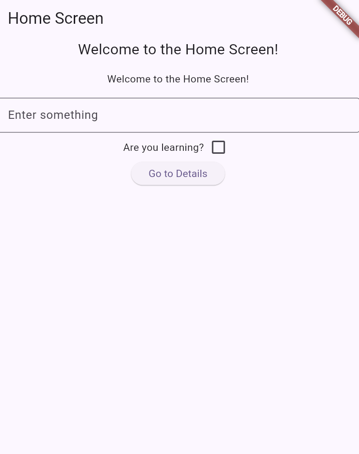
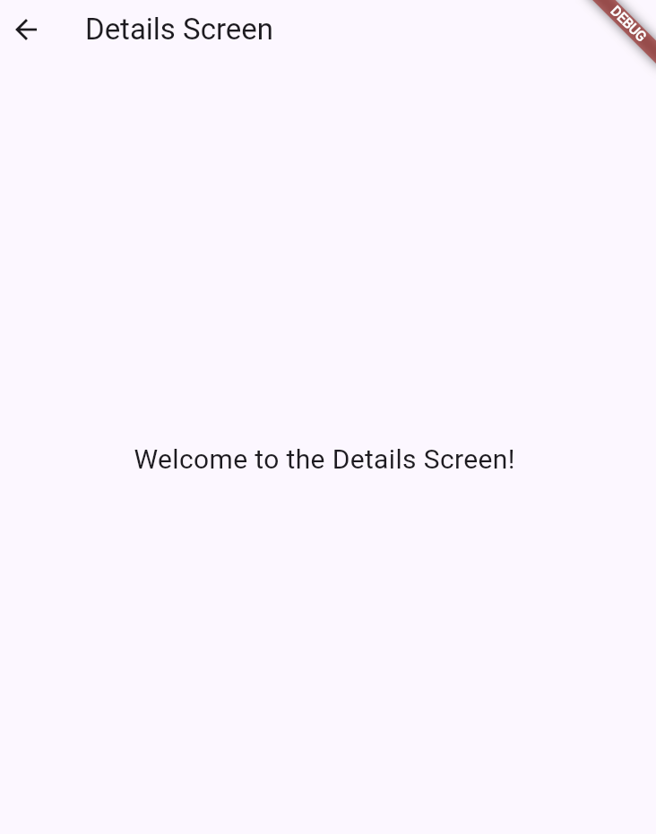

# 🚀 Flutter Navigation Demo

This project is designed to demonstrate how to navigate between activities (widgets) in Flutter. It provides a simple example of screen transitions, navigation flows, and best practices for managing routes in a cross-platform Flutter application.

## 📑 Table of Contents

- [📝 Description](#-description)
- [✨ Features](#-features)
- [🛠️ Technologies Used](#️-technologies-used)
- [🚀 Installation](#-installation)
- [📱 Usage](#-usage)
- [📂 Project Structure](#-project-structure)
- [🖼️ Screenshots](#-screenshots)
- [🤝 Contributing](#-contributing)
- [📄 License](#-license)

## 📝 Description

The main goal of this Flutter app is to show how to navigate between different screens (widgets) using Flutter's navigation system. The app includes a main activity and additional screens, allowing users to move back and forth to understand navigation concepts. The UI is simple and focuses on clarity for learning purposes.

## ✨ Features

- Demonstrates navigation between activities (widgets)
- Simple and clear UI for learning navigation
- Cross-platform support (Android, iOS, Web, Desktop)
- Example of route management and screen transitions
- Asset management for images and icons

## 🛠️ Technologies Used

- **Flutter**: UI toolkit for building natively compiled applications
- **Dart**: Programming language for Flutter
- **Android Studio / VS Code**: Recommended development environments

## 🚀 Installation

1. Clone the repository:
	```bash
	git clone https://github.com/your-username/MobileDevCourse.git
	```
2. Open the `Tarea2Flutter` project in your preferred IDE (Android Studio or VS Code).
3. Run `flutter pub get` to fetch dependencies.
4. Launch the app on an emulator, simulator, or physical device:
	```bash
	flutter run
	```

## 📱 Usage

1. Start the app to view the main activity (widget).
2. Use provided buttons or menu options to navigate to other screens.
3. Use the back button or navigation controls to return to the main activity.

## 📂 Project Structure

```
Tarea2Flutter/
├── lib/
│   ├── main.dart
│   ├── config/
│   ├── core/
│   ├── data/
│   ├── domain/
│   ├── l10n/
│   ├── presentation/
│   └── utils/
├── assets/
│   ├── activity.png
│   ├── otherScreen.png
├── test/
│   └── widget_test.dart
├── android/
├── ios/
├── web/
├── linux/
├── macos/
├── windows/
├── pubspec.yaml
└── README.md
```

## 🖼️ Screenshots

Below are screenshots of the app located in the `assets/` folder:

### Main Activity (Widget)


### Other Screen (Widget)


## 🤝 Contributing

Contributions are welcome! Please open an issue or submit a pull request for suggestions or improvements.

## 📄 License

This project is licensed under the MIT License. See the `LICENSE` file for details.
For help getting started with Flutter development, view the
[online documentation](https://docs.flutter.dev/), which offers tutorials,
samples, guidance on mobile development, and a full API reference.
